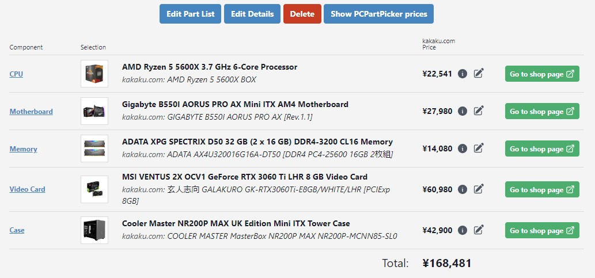
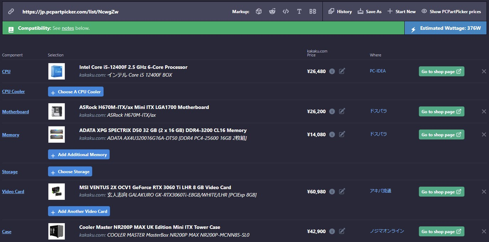
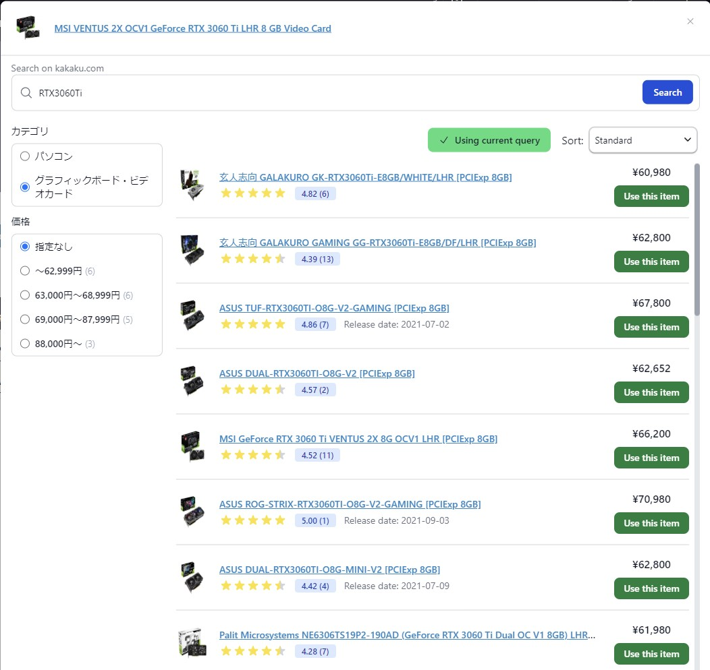
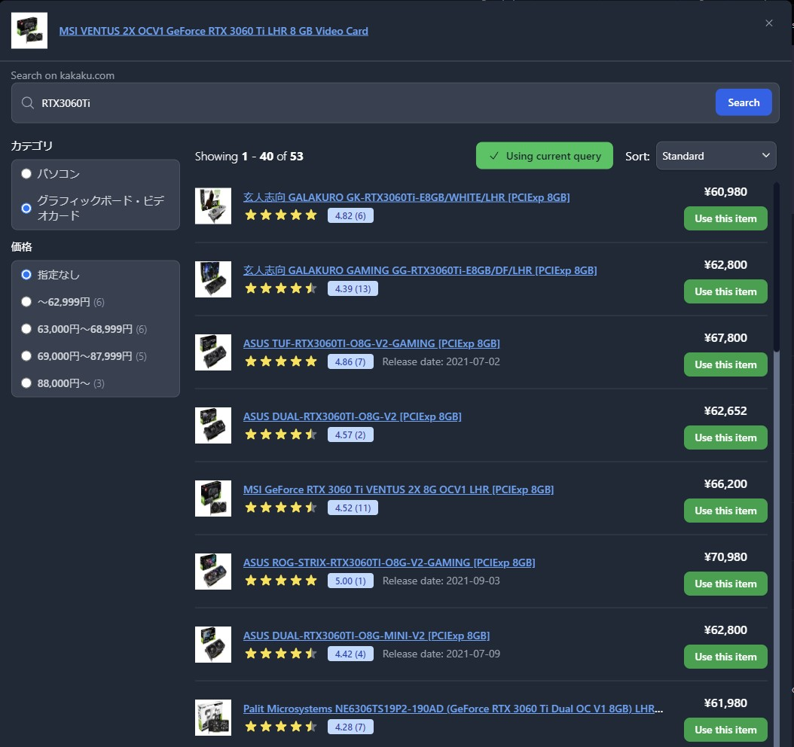
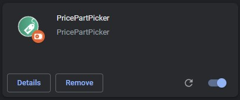
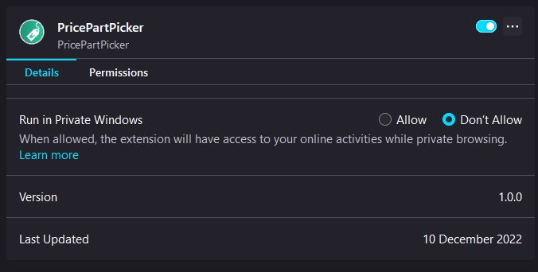

[](http://makeapullrequest.com)


# &nbsp; Price Part Picker <sub><sup><sub><sup><i>(need a better name and icon)</i></sup></sub></sup></sub>

A web Extension to show [kakaku.com](kakaku.com) prices on [PCPartPicker](pcpartpicker.com). Currently only on the 'Saved Parts Lists' page and 'Choose Your Parts' page.

*This project was initially created using the [react-typescript-web-extension-starter](https://github.com/aeksco/react-typescript-web-extension-starter) template.*

---

## Features

- Search and link a PCPartPicker part to a kakaku.com product.
- You can also link a particular search query instead of an explicit item. The first item of the search result is used to display the price.
- Hide PCPartPicker's price column.
- Dark mode is in sync with the PCPartPicker's dark mode.

**Not completed**
- Japanese localization (help needed)

---

### Screenshots

**Saved parts list (light mode)**


**Choose you parts (dark mode)**


**Search dialog (light mode)**


**Search dialog (dark mode)**


# Development

**Getting Started**

Run the following commands to install dependencies and start developing

```
yarn install
yarn dev
```

**Scripts**

-   `yarn dev` - run `webpack` in `watch` mode
-   `yarn storybook` - runs the Storybook server
-   `yarn web-ext:chrome` - Runs Chrome in a new profile and installs the extension
-   `yarn web-ext:firefox-v2` - Runs Firefox in a new profile and installs the manifest v2 version of the extension
-   `yarn web-ext:firefox-v3` - Runs Firefox in a new profile and installs the manifest v3 version of the extension (Please read below for further instructions)
-   `yarn build` - builds the production-ready unpacked extension
-   `yarn test -u` - runs Jest + updates test snapshots (currently no noteworthy jest tests added)
-   `yarn lint` - runs EsLint
-   `yarn prettify` - runs Prettier

<details>
  <summary>Loading the extension in a chromium based browser (Google Chrome, Microsoft Edge, Brave, etc)</summary>

There are two ways of running the extension in a chromium based browser. Make sure you have already run `yarn dev` or `yarn build`.

1. Using the web-ext tool (Recommended): Run `yarn web-ext:chrome`. This will start the browser using a new profile and install the extension. For configuration options check `web-ext.chrome.config.js`. See all available configuration options [here](https://extensionworkshop.com/documentation/develop/web-ext-command-reference/#commands).
2. Manual: In [Google Chrome](https://www.google.com/chrome/), open up [chrome://extensions](chrome://extensions) in a new tab. Make sure the `Developer Mode` checkbox in the upper-right corner is turned on. Click `Load unpacked` and select the `dist/chrome` directory in this repository - your extension should now be loaded. This process will be similar for all chromium based browsers.



</details>

<details>
  <summary>Loading the extension in Mozilla Firefox</summary>

There are two ways of running the extension in Mozilla Firefox. Make sure you have already run `yarn dev` or `yarn build`.
1. Using the web-ext tool (Recommended):
    - **For manifest v2 version**: Run `yarn web-ext:firefox-v2`. This will start the browser using a new profile and install the extension. For configuration options check `web-ext.firefox.v2.config.js`. See all available configuration options [here](https://extensionworkshop.com/documentation/develop/web-ext-command-reference/#commands).
    - **For manifest v3 version**: Run `yarn web-ext:firefox-v3`. This will start the browser using a new profile and install the extension. **Currently you will have to manually grant the extension the permissions to access pcpricepicker.com and kakaku.com**. To do this open `about:addons`, click the extension, go to the `Permissions` tab, and enable the disabled permissions. For more run configuration options check `web-ext.firefox.v2.config.js`. See all available configuration options [here](https://extensionworkshop.com/documentation/develop/web-ext-command-reference/#commands).
2. Manual:
    - **For manifest v2 version**: In [Mozilla Firefox](https://www.mozilla.org/en-US/firefox/new/), open up the [about:debugging](about:debugging) page in a new tab. Click the `This Firefox` link in the sidebar. One the `This Firefox` page, click the `Load Temporary Add-on...` button and select the `manifest.json` from the `dist/firefox/v2` directory in this repository - your extension should now be loaded.
    - **For manifest v3 version**: First follow the instructions mentioned [here](https://extensionworkshop.com/documentation/develop/manifest-v3-migration-guide/#turn-on-the-developer-preview). Then follow the instructions mentioned for the manifest v2 version but load the `dist/firefox/v3` directory.



</details>

**Notes**
-   Includes ESLint configured to work with TypeScript and Prettier.

-   Includes tests with Jest - note that the `babel.config.js` and associated dependencies are only necessary for Jest to work with TypeScript.

-   Recommended to use `Visual Studio Code` with the `Format on Save` setting turned on.

-   Icons courtesy of [Heroicons](https://heroicons.com/).

-   Includes Storybook configured to work with React + TypeScript. Note that it maintains its own `webpack.config.js` and `tsconfig.json` files.

-   Includes a custom mock for the [webextension-polyfill-ts](https://github.com/Lusito/webextension-polyfill-ts) package in `src/__mocks__`. This allows you to mock any browser APIs used by your extension so you can develop your components inside Storybook.

**Built with**

-   [React](https://reactjs.org)
-   [TypeScript](https://www.typescriptlang.org/)
-   [Storybook](https://storybook.js.org/)
-   [Jest](https://jestjs.io)
-   [Eslint](https://eslint.org/)
-   [Prettier](https://prettier.io/)
-   [Webpack](https://webpack.js.org/)
-   [Babel](https://babeljs.io/)
-   [TailwindCSS](https://tailwindcss.com/)
-   [Flowbite](https://flowbite.com/)
-   [webextension-polyfill](https://github.com/mozilla/webextension-polyfill)

**Misc. References**

-   [Chrome Extension Developer Guide](https://developer.chrome.com/extensions/devguide)
-   [Firefox Extension Developer Guide](https://developer.mozilla.org/en-US/docs/Mozilla/Add-ons/WebExtensions/Your_first_WebExtension)
-   [Eslint + Prettier + Typescript Guide](https://dev.to/robertcoopercode/using-eslint-and-prettier-in-a-typescript-project-53jb)
